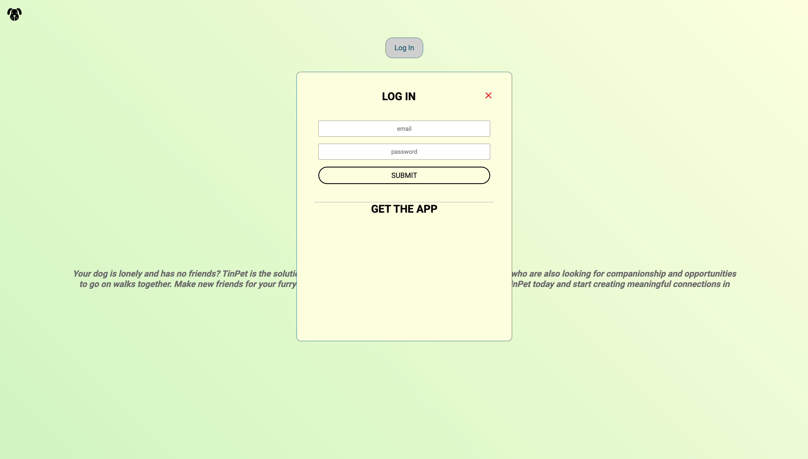
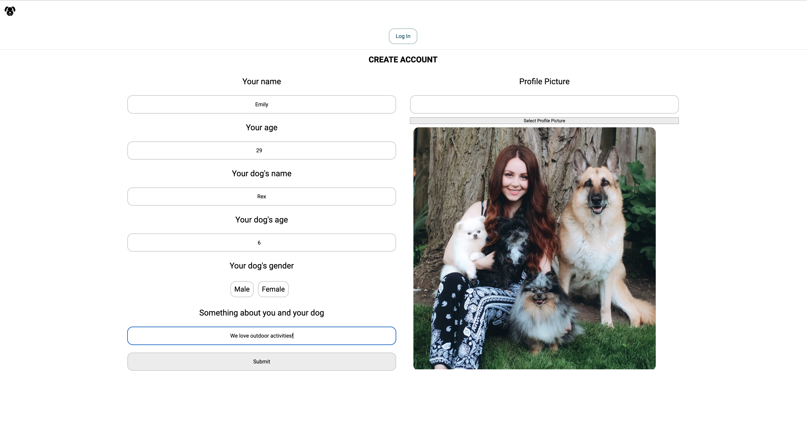
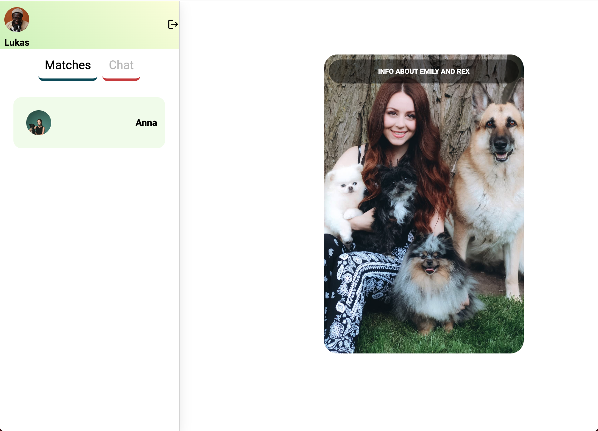
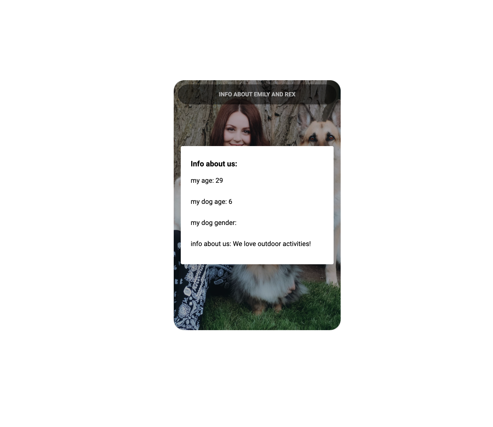

# Tinpet

Tinpet is a web app which allows dog owners to match with each other. They can connect with like-minded dog owners, allowing them and their dogs to meet up and go on walks together. It's a quick and easy way to find other dog lovers, find friends for your dog and get to know your local dog community.

## Getting Started

Clone the repo:
git clone https://github.com/Luigi-Faldetta/tinpet-final.git

Navigate to the client and server folders:
```console
cd client // cd server
```
Install the required dependencies on each folder:
```console
npm install
```
Start development server:
```console
npm run dev
```
Start vite in client:
```console
npm run dev
```

Set up the required environment variables or update and leave the default values for the MongoDB credentials and ports. 

## Tech Stack

You can find a breakdown of the technologies used below:

Front-end: TypeScript, Tailwind, daisyUI, React, Vite, Cloudinary.

Back-end: Node.js, Express, Mongoose, MongoDB, JWT, bcrypt.

Additionally, Socket.io was used to handle WebSockets for the chat functionality and unit testing was performed using Jest, Vitest and React Testing Library.

## Screenshots


*Log In page*


*Create profile page*


*Matching Page*


*TinCard*
